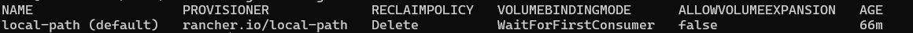
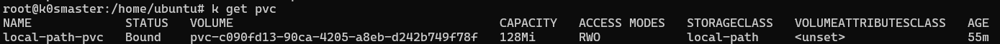

#SETUP

1 ejecutar  el siguiente comando 
 kubectl apply -f  storage-provisioner.yml

2 verificar creacion de storageclass

3 aplicar objetos dentro de la carpteta ./test 

4 verificar creacion y asignacion de almacenamiento  con el comando 

asegurar su estado sea  bound 

5 eliminar componentes carpta test

kubectl delete ./test
